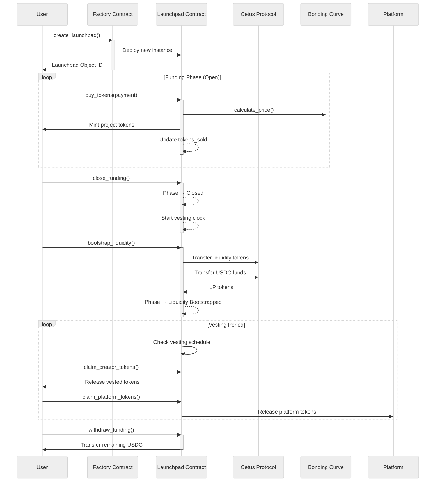
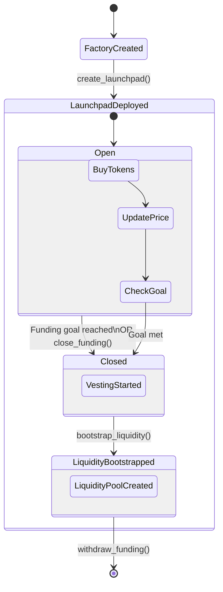
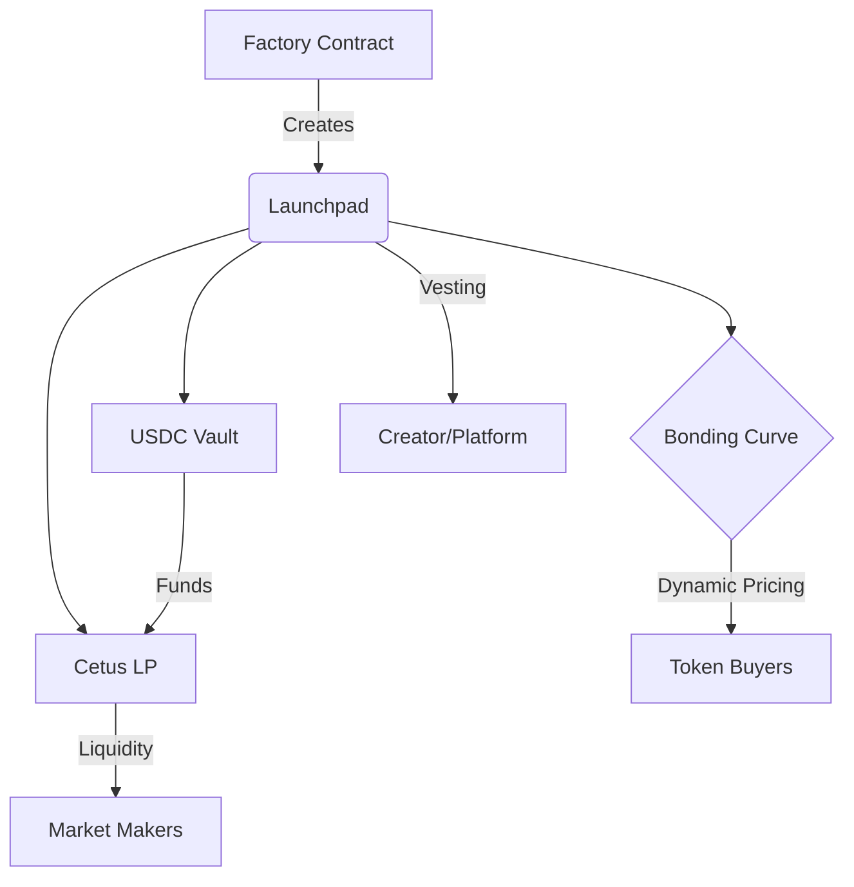

# BondCraft: Decentralized Token Launchpad on Sui

[](https://sui.io/)
[](https://move-language.github.io/move/)
[](LICENSE)
[](https://github.com/signor1/bondcraft/actions)

**BondCraft** is a decentralized token launchpad built on the [Sui blockchain](https://sui.io/), leveraging the [Move programming language](https://move-language.github.io/move/) to enable secure, transparent, and efficient token launches. Integrated with [Cetus Protocol](https://www.cetus.zone/), BondCraft facilitates seamless liquidity bootstrapping for new tokens using bonding curves.

## 🚀 Features

- **Token Creation**: Deploy tokens with configurable supply/funding goals
- **Bonding Curve Pricing**: Fair distribution via dynamic pricing models
- **Cetus Integration**: Auto-create liquidity pools (TOKEN/USDC)
- **Vesting System**: Secure vesting for team/platform tokens
- **Sui Blockchain**: High-throughput transactions with low fees

### Showing the core flow of BondCraft's token launch process



### Here's the visual breakdown of key states and transitions



### Key Components



## 📖 Table of Contents

- [Installation](#installation)
- [Usage](#usage)
- [Architecture](#architecture)
- [Testing](#testing)
- [Contributing](#contributing)
- [License](#license)

## 🛠 Installation

### Prerequisites

- [Sui CLI](https://docs.sui.io/build/cli-client) ≥ v1.0.0
- [Rust](https://www.rust-lang.org/tools/install)
- Testnet USDC (`sui client faucet`)

```bash
git clone https://github.com/signor1/bondcraft.git
cd bondcraft
sui move build
```

## 📦 Dependencies

```toml
[dependencies]
Sui = { git = "https://github.com/MystenLabs/sui.git", subdir = "crates/sui-framework/packages/sui-framework", rev = "framework/testnet" }
usdc = { git = "https://github.com/circlefin/stablecoin-sui.git", subdir = "packages/usdc", rev = "master" }
CetusClmm = { git = "https://github.com/CetusProtocol/cetus-clmm-sui.git", subdir = "contracts", rev = "main" }
```

## 🎮 Usage

### Deploy Launchpad

```bash
sui client publish --gas-budget 100000000
```

### Create Token Launch

```bash
sui client call --package <PACKAGE_ID> --module factory --function create_launchpad \
  --type-args bond_craft::test_witness::TEST_TOKEN \
  --args <FACTORY_ID> "{\"symbol\": \"BOND\", \"decimals\": 9, \"total_supply\": 1000000000}" \
  --gas-budget 10000000
```

### Bootstrap Liquidity

```bash
sui client call --package <PACKAGE_ID> --module launchpad --function bootstrap_liquidity \
  --args <LAUNCHPAD_ID> <CETUS_POOL_ID> \
  --gas-budget 10000000
```

## 📜 Architecture

| Contract          | Description                           |
|-------------------|---------------------------------------|
| `factory.move`    | Launchpad creation & management       |
| `launchpad.move`  | Token sales & liquidity bootstrapping |
| `bonding_curve.move` | Dynamic pricing algorithms         |

Key Features:

- Ownership verification (`EUNAUTHORIZED` checks)
- Phase transitions (`EINVALID_PHASE` validation)
- Cetus pool integration (0.3% default fee tier)

## 🧪 Testing

Run test suite:

```bash
sui move test
```

Key Test Cases:

- Token allocation validation
- Bonding curve price calculations
- Liquidity pool creation
- Vesting schedule enforcement

## 🤝 Contributing

1. Fork the repository
2. Create feature branch (`git checkout -b feature/your-feature`)
3. Commit changes (`git commit -m "Add feature"`)
4. Push to branch (`git push origin feature/your-feature`)
5. Open Pull Request
