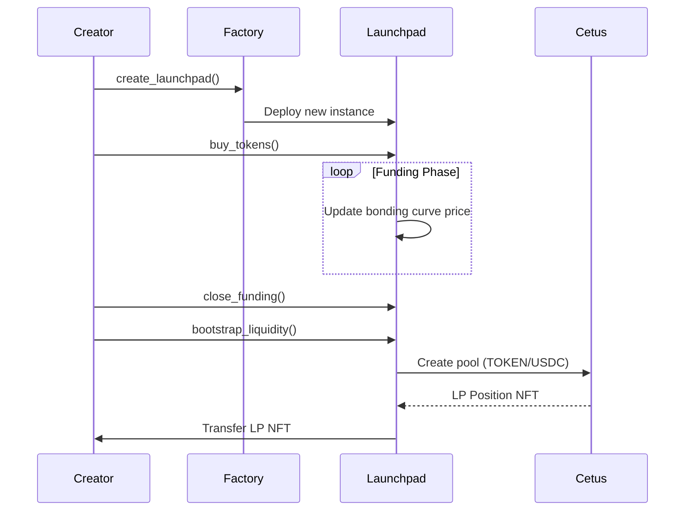

# BondCraft: Decentralized Token Launchpad on Sui

[](https://sui.io/)
[](https://move-language.github.io/move/)
[](https://www.cetus.zone/)
[](https://pyth.network/)
[](https://unicoinsui.com/)

**BondCraft** is a decentralized token launchpad built on the [Sui blockchain](https://sui.io/), leveraging the [Move programming language](https://move-language.github.io/move/) to enable secure, transparent, and efficient token launches. Integrated with [Cetus Protocol](https://www.cetus.zone/) for seamless liquidity bootstrapping, BondCraft uses bonding curves to ensure fair token distribution. Designed for the Sui Overflow Hackathon, BondCraft aligns with the DeFi and Degen tracks, with planned integrations for [Pyth Network](https://pyth.network/) (real-time price oracles) and [UNI](https://unicoinsui.com/) (meme token launches).

## Features

- **Token Creation**: Deploy tokens with customizable supply and funding goals.
- **Bonding Curve Pricing**: Dynamic pricing for fair and transparent token distribution.
- **Cetus Protocol Integration**: Automatically create TOKEN/USDC liquidity pools on Cetus with a 0.05% fee tier.
- **Vesting System**: Secure vesting schedules for creator and platform tokens.
- **Sui Blockchain**: High-throughput, low-fee transactions for scalable launches.
- **Future Integrations**:
  - **Pyth Network**: Real-time price oracles for accurate bonding curve pricing (DeFi track).
  - **UNI (Unicoinsui)**: Support for meme token launches with community-driven liquidity pools (Degen track).

## Architecture



### Published Package & Factory ID

- Published BondCraft [Package ID](https://suiscan.xyz/testnet/object/0x9495333f9d631a7e558f4a0f2577f9a9c95d19ac1363a8322abd6b228151de26/tx-blocks)
- BondCraft Factory ID [Factory ID](https://suiscan.xyz/testnet/object/0x545a131ac41903f9e9a822c5b7ebd97db5df1faaa7f1d30c3dea176207237945/tx-blocks)

### Roadmap

- **Pyth Network Integration (DeFi):**
  - Deploy Pyth price feeds for USDC and SUI on testnet.
  - Update bonding curve to use real-time oracle pricing.
  - Testnet demo for oracle-driven token launches.

- **UNI (Unicoinsui) Integration (Degen):**
  - Add meme token creation with simplified parameters.
  - Create UNI/SUI liquidity pools on Cetus (0.25% fee tier).
  - Testnet demo with community airdrop incentives.

- **Mainnet Launch:**
  - Deploy Pyth and UNI integrations on Sui mainnet.
  - Explore cross-chain support via Wormhole or CCTP.

## 🛠 Installation

### Prerequisites

- [Sui CLI](https://docs.sui.io/build/cli-client) ≥ v1.26.0
- [Rust](https://www.rust-lang.org/tools/install)
- Testnet USDC: [Circle](https://faucet.circle.com/)

```bash
git clone https://github.com/signor1/bondcraft.git
cd bondcraft
sui move build
```

## 📦 Dependencies

```toml
[dependencies]
Sui = { git = "https://github.com/MystenLabs/sui.git", subdir = "crates/sui-framework/packages/sui-framework", rev = "testnet-v1.26.0" }
CetusClmm = { git = "https://github.com/CetusProtocol/cetus-clmm-interface.git", subdir = "sui/cetus_clmm", rev = "testnet-v1.26.0", override = true }
USDC = { git = "https://github.com/circlefin/stablecoin-sui.git", subdir = "packages/usdc", rev = "testnet" }
```

## 🎮 Usage

### Deploy Contracts

```bash
sui client publish --gas-budget 100000000
```

### Create Launchpad

```bash
sui client call --package <PACKAGE_ID> \
  --module factory \
  --function create_launchpad \
  --type-args bond_craft::test_witness::TEST_TOKEN \
  --args <FACTORY_ID> "b\"SYMBOL\"" "b\"Token Name\"" 9 1000000000 500000000 200000000 200000000 100000000 500000000 \
  --gas-budget 10000000
```

### Bootstrap Liquidity

```bash
sui client call --package <PACKAGE_ID> \
  --module launchpad \
  --function bootstrap_liquidity \
  --type-args <TOKEN_TYPE> \
  --args <LAUNCHPAD_ID> <CETUS_CONFIG_ID> <CETUS_POOLS_ID> <METADATA_T_ID> <METADATA_USDC_ID> <CLOCK_ID> \
  --gas-budget 100000000
```

## 📜 Contract Structure

| Module | Description |
|--------|-------------|
| `factory.move` | Manages launchpad creation and tracking |
| `launchpad.move` | Handles token sales, vesting, and Cetus integration |
| `bonding_curve.move` | Implements price calculations `P(x) = kx/1e9` |
| `pool.move` | Cetus CLMM pool creation logic |

## 🧪 Testing

```bash
sui move test
```

Key Test Cases:

- Token allocation validation
- Bonding curve price calculations
- Liquidity pool creation
- Vesting schedule enforcement

## 🤝 Contributing

1. Fork the repository
2. Create feature branch (`git checkout -b feature/your-feature`)
3. Commit changes (`git commit -m "Add feature"`)
4. Push to branch (`git push origin feature/your-feature`)
5. Open Pull Request
